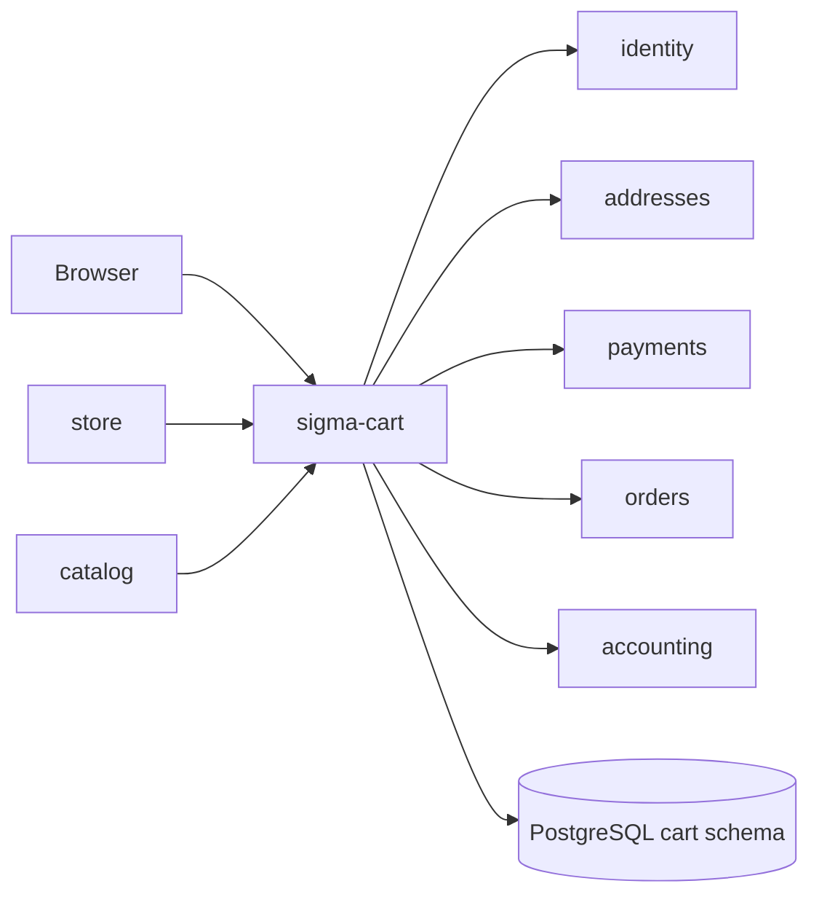

# sigma-cart architecture

`sigma-cart` is the shopping cart service for Sigma Tactical Group. It persists guest and signed-in carts, validates lines against the catalog, prices them from the storefront, and runs the order-first checkout saga that reserves a deposit against payments and orders.

## Context



This service owns the PostgreSQL `cart` schema: `cart.carts` and `cart.cart_lines`.

## Runtime shape

The `sigma-cart` binary initializes tracing, validates configuration (including `DATABASE_URL`), connects `CartStore` to PostgreSQL, then hands `sigma_cart::routes(store)` to `sigma_theme::warp::serve`. The theme crate supplies the Warp server, shared static assets, security headers, and the listen address from `PORT`.

Guest carts use the `sigma_cart` cookie; signed-in carts bind to the identity user id from session status checks. Listing prices come from the store `/items` feed, not the catalog.

## Request flow

`routes()` combines public and admin web routes from `web.rs` with the internal JSON API from `api.rs`. Public routes cover cart browsing, line changes, and checkout. Admin routes under `/admin` manage carts when reached through the identity proxy.

Checkout requires an identity session. `GET /checkout` loads priced lines, billing and shipping addresses, and payment methods, then renders the 50% deposit form. `POST /checkout` validates choices and runs the deposit saga below. `POST /reserve` redirects to `/checkout`.

```mermaid
sequenceDiagram
    actor Browser
    participant Cart as cart
    participant Identity as identity
    participant Addresses as addresses
    participant Payments as payments
    participant Orders as orders
    participant Accounting as accounting

    Browser->>Cart: GET /checkout (cookie)
    Cart->>Identity: session status
    Cart->>Addresses: list billing/shipping
    Cart->>Payments: list payment methods
    Cart-->>Browser: checkout form (50% deposit)

    Browser->>Cart: POST /checkout (addresses + method)
    Note over Cart: validate session, lines, choices, deposit > 0

    Cart->>Orders: POST /orders (status=pending_deposit, cart_id)
    Note over Orders: idempotent per cart_id
    Orders-->>Cart: order (pending_deposit)

    alt already deposit_paid / in_build / shipped
        Cart-->>Browser: reserved success page
    else pending_deposit
        Cart->>Payments: POST /api/charges (ref=order_id)
        Note over Payments: idempotent per order_id
        Payments-->>Cart: charge succeeded

        Cart->>Orders: POST /orders/{id}/deposit-paid (charge_id)
        alt commit OK
            Orders-->>Cart: order deposit_paid
            Cart->>Accounting: POST receipt (best-effort)
            Cart->>Cart: cart status=submitted; clear cookie
            Cart-->>Browser: reserved success page
        else commit fails
            Cart->>Payments: POST /api/charges/{id}/refund
            Cart-->>Browser: error (refunded or support quote)
        end
    end
```

The saga reserves a `pending_deposit` order before any charge, keys the charge on `order_id` for idempotency, calls `mark_deposit_paid` to commit, pushes an accounting receipt best-effort, and refunds the deposit if the commit fails.

## Code map

| Path | Responsibility |
| --- | --- |
| `src/main.rs` | Tracing, config validation, store connect, and server start. |
| `src/lib.rs` | Assembles web UI, JSON API, health, theme, and CSP routes. |
| `src/config.rs` | Reads public URLs, internal peer URLs, cookie domain, and Keycloak settings. |
| `src/store.rs` | Cart and line persistence, status transitions. |
| `src/web.rs` | Public cart UI, checkout saga, and admin pages. |
| `src/api.rs` | Internal-token JSON API for carts and lines. |
| `src/catalog.rs` | HTTP client to validate SKU metadata. |
| `src/storefront.rs` | HTTP client to store `/items` for listing prices. |
| `src/payments_client.rs` | Charge and refund calls to payments. |
| `src/accounting_client.rs` | Best-effort receipt push to accounting. |
| `src/identity.rs` | Keycloak user lookup for admin views. |
| `src/templates/` | Askama HTML for cart, checkout, and reserved pages. |

## Data

PostgreSQL schema `cart` holds cart headers and line items keyed by cart id. Cart status moves to `submitted` after a successful checkout. Checkout snapshots live in the orders schema; charges and receipts live in payments and accounting respectively.

## Configuration

| Environment variable | Purpose |
| --- | --- |
| `PORT` | Listen port supplied to the theme crate. |
| `CART_PUBLIC_BASE_URL` | Canonical public URL of this cart service. |
| `CART_IDENTITY_PUBLIC_URL` | Identity BFF URL for session checks and navbar links. |
| `CART_CONTACT_PUBLIC_URL` | Contact-service URL for the shared chrome. |
| `CART_STORE_PUBLIC_URL` | Storefront URL for product links and continue-shopping navigation. |
| `CART_ADDRESSES_PUBLIC_URL` | Addresses URL for checkout “add address” links. |
| `CART_PAYMENTS_PUBLIC_URL` | Payments URL for checkout “add payment method” links. |
| `CART_INFO_PUBLIC_URL` | Info-site URL for Terms and Conditions (`/doc/terms`). |
| `CART_CATALOG_BASE_URL` | Optional catalog integration for SKU validation. |
| `CART_STORE_BASE_URL` | Optional internal store URL for authoritative listing prices (`/items`). |
| `CART_IDENTITY_INTERNAL_URL` | Cluster-internal identity URL for session status checks. |
| `CART_ORDERS_BASE_URL` | Optional internal orders URL for checkout commit. |
| `CART_ADDRESSES_INTERNAL_URL` | Optional internal addresses URL for checkout address lists. |
| `CART_ACCOUNTING_INTERNAL_URL` | Optional internal accounting URL for deposit receipt push. |
| `CART_PAYMENTS_INTERNAL_URL` | Optional internal payments URL for methods and charges. |
| `CART_COOKIE_DOMAIN` | Optional guest-cart cookie `Domain` for sibling subdomains. |
| `CART_IDENTITY_ISSUER_URL` | Optional Keycloak issuer URL for admin user lookup. |
| `CART_IDENTITY_CLIENT_ID` | Optional service-account client id for Keycloak Admin API. |
| `CART_IDENTITY_CLIENT_SECRET` | Optional service-account client secret for Keycloak Admin API. |

## Deployment

`Dockerfile` produces the `sigma-cart` image. The platform deployment is at `../platform/services/cart/base/deployment.yaml`; it exposes container port `8080` through `../platform/services/cart/base/service.yaml` on service port `80`.

The public VirtualService and environment overlays reside beside the base manifests under `../platform/services/cart/`. Production hostname and platform context are documented in [`../platform/README.md`](../platform/README.md).

## Testing

Run `cargo test -p sigma-cart`. Integration tests in `src/lib.rs` use `test_support::db_guard()` for database serialization and cover `/up`, the index page, API cart creation, and checkout saga scenarios (order-before-charge ordering, idempotent resubmit, refund on commit failure). Tests use `sigma_pg::test_helpers::ready_store`.

## Design notes

- Order-first checkout prevents stranded charges: the order exists in `pending_deposit` before money moves.
- Idempotency on `cart_id` (orders) and `order_id` (charges) makes browser retries safe.
- Accounting receipt push is best-effort; reconcile can backfill from payments.
- Admin and JSON API routes are intended behind the identity BFF proxy in production.
